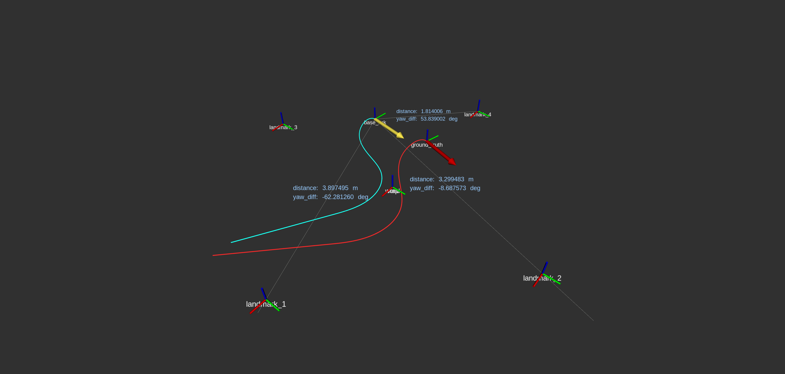

## nav_sim  
2D simple robot simulator.

### input topic
| topic | purpose | message type |
| :--- | :---: | ---: |
| /cmd_vel | input velocity | geometry_msgs/Twist |
| /initialpose | set initial robot pose  | geometry_msgs/PoseWithCovarianceStamped |

### output topic
| topic | purpose | message type |
| :--- | :---: | ---: |
| /current_pose | current position of robot with error | geometry_msgs/PoseStamped |
| /ground_truth | ground truth position of robot without error | geometry_msgs/PoseStamped |
| /landmark_info | landmark visualization information | visualization_msgs/MarkerArray |
| /observation | observation data(location of landmark from robot) | nav_sim/LandmarkInfo |
| /odom | odometry data of robot | nav_msgs/Odometry |
| /twist | current velocity of robot | geometry_msgs/TwistStamped |
